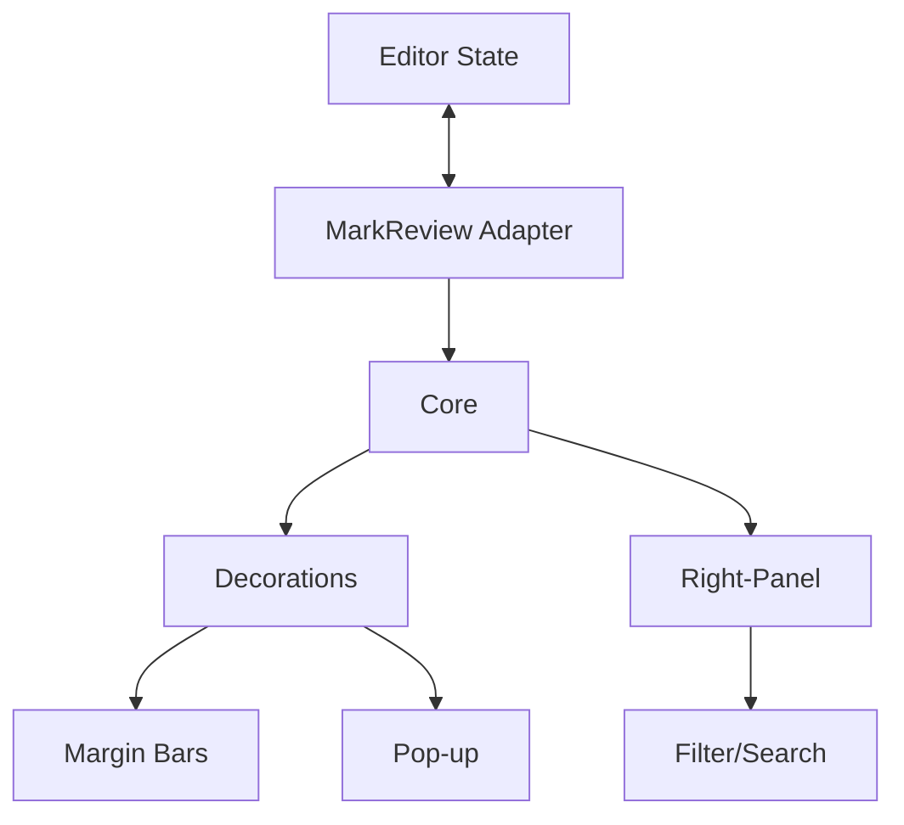

### Product Requirements Document — **MarkReview v 1.0**

*(Word-style track-changes, WCAG-AA change-bars, threaded comments, and right-panel review list for any ProseMirror-based editor)*

---

## 0 · Executive Summary

**MarkReview** is an **npm package** that adds Word-grade review tooling to modern web documentation editors powered by ProseMirror ≥ 1.23 (TipTap 3, Toast UI 3, Milkdown 8, Docusaurus MDX, etc.).
Features delivered in-editor:

| Core 1.0 capabilities | Highlights                                                                                                    |
| --------------------- | ------------------------------------------------------------------------------------------------------------- |
| Track Changes         | colored insertions, deletions, substitutions, **format-change tracking** (bold→italic, list→paragraph, etc.) |
| Change-Bars           | 2-3 px bar on left or right margin; width & color customizable; auto-swaps for RTL docs                      |
| Review UI             | inline pop-up ✓ / ✗ / 💬, right-panel list with filter chips & live counters                              |
| Comments              | threaded, resolve/unresolve, author avatar, `@mentions`                                                       |
| Accessibility/i18n    | WCAG-AA palette, full keyboard path, locale packs                                                             |
| Developer API         | `MarkReview.attach(editor, options)` adapters + headless diff export                                          |
| Security              | zero network calls; AI rewrite lives in separate and future NPM package                                     |

All review data is stored as **ProseMirror marks** (or CriticMarkup in Markdown) so edits persist through normal save/export flows.

---

## 1 · Problem Statement & Goals

| ID  | Pain-point                                               | Goal (v 1.0)                                   |
| --- | -------------------------------------------------------- | ---------------------------------------------- |
| P-1 | Reviewers jump to Word/Docs to see diffs.                | Visual diffs & bars directly in the editor.    |
| P-2 | No accept/reject or comment workflow in most JS editors. | Pop-up ✓/✗, threaded comments, overview panel. |
| P-3 | Hard to track remaining edits.                           | Right-panel list with counters & keyboard nav. |
| P-4 | Review UIs ignore accessibility & intl layouts.          | WCAG-AA palette, full keyboard & ARIA labels, keyboard map for non-US layouts.  |

---

## 2 · Personas & Key Stories

| Persona       | Key Story                                                                                  |
| ------------- | ------------------------------------------------------------------------------------------ |
| **Writer**    | Turns *Track Changes ON*, drafts; blue insertions, red deletions, purple substitutions & format-changes appear with margin bars.           |
| **Reviewer**  | Opens right panel, filters to "insertions", arrow-keys through cards, ✓/✗ or comments without scrolling. |
| **Docs Lead** | Publishes when panel counter hits **0 open changes**; only accepted text is saved.         |

---

## 3 · Scope & Phasing

| Release         | Target editors             | Headline features                                                                                                                       |
| --------------- | -------------------------- | --------------------------------------------------------------------------------------------------------------------------------------- |
| 0.1 Preview | TipTap, Toast UI, Milkdown | CriticMarkup render, change-bars, pop-up accept/reject.                                                                                 |
| 1.0 GA      | All ProseMirror ≥ 1.23 | 0.1 **plus** → right-panel list (filter & search), threaded comments, format-change tracking, user attribution, toolbar toggles, bar side/width/colour customisation, locale packs, RTL auto-swap, persistent marks, international keyboard-map support. |
| 2.x Growth      | same                       | Suggestion mode, bulk ops, export (DOCX/PDF/CSV/JSON), audit trail. headless diff API. *(Milkdown serializer hooks land here.)*           |
| 3.x Collab      | live-collab editors        | Real-time presence, revision history, conflict resolution, dashboards.                                        |

---

## 4 · Functional Requirements (v 1.0)

| ID      | Requirement                                                                                                                                        | Priority |
| ------- | -------------------------------------------------------------------------------------------------------------------------------------------------- | -------- |
| F-1  | Parse/render CriticMarkup (add/del/subst/highlight/comment).                                                                 | Must          |
| F-2  | Track format changes and display them.                                                                                   | Must          |
| F-3  | Accessible palette (blue ins, red del, purple subst) via CSS vars.                                                           | Must          |
| F-4  | Change-bar on left/right; width & colour configurable; auto RTL swap.                                                        | Must          |
| F-5  | Toolbar toggles – Track, Bars (state in `localStorage`).                                                                     | Must          |
| F-6  | Pop-up ✓ / ✗ / 💬 (`a`/`r`/`c` shortcuts).                                                                                   | Must          |
| F-7  | Right-panel list – cards, counters, collapse/resize, filter chips, text search, ↑/↓ + Enter nav.                         | Must          |
| F-8  | Threaded comments with `@mentions`; resolve/unresolve.                                                                       | Must          |
| F-9  | User-identity adapter (`getCurrentUser()` hook).                                                                             | Must          |
| F-10 | Actions persist to ProseMirror doc; clean export when Track OFF.                                                             | Must          |
| F-11 | Keyboard-map utility: shortcuts bound to `event.code`, user-remappable UI; works on QWERTY, AZERTY, QWERTZ, RTL layouts. | Must          |
| F-12 | Public TS API & adapters; headless `diffDoc()` export (Should).                                                              | Must / Should |
| F-13 | Bundle ≤ 10 kB JS + 5 kB CSS (gzip); scan < 5 ms on 2 MB doc.                                                                | Must          |
| F-14 | Docs folder + tooltip help; WCAG 2.2 AA compliance; locale JSON.                                                             | Must          |

---

## 5 · Non-Functional Requirements

* **Peer Dependencies** `prosemirror-*` **^1.23.0** (tested through 1.25.x).
* **Bundles** ESM + CJS; side-effects flagged for tree-shaking; TypeScript declarations included.
* **Testing** Jest + Playwright ≥ 90% coverage; ESLint + Prettier; TypeScript strict mode enabled.
* **Security** No network calls, CSP-safe, Content Security Policy compliant.
* **SemVer** Major bumps track host-editor majors; follows npm semantic versioning.
* **TypeScript** Strict mode enabled; comprehensive type definitions; no `any` types in public API.
* **Performance** Bundle size ≤ 10 kB JS + 5 kB CSS (gzipped); tree-shakeable exports.

---

## 6 · System Architecture



---

## 7 · UI Overview

| Component   | Key points                                                                                                                  |
| ----------- | --------------------------------------------------------------------------------------------------------------------------- |
| Toolbar     | 📝 Track · ▌ Bars · 🎛 Filter                                                                                               |
| Margin bar  | 2 px strip, colour = highest-priority change                                                                                |
| Pop-up      | snippet + ✓/✗/💬; author & time on hover                                                                                    |
| Right panel | 280 px resizable; filter chips (I D C F), text search box, ↑/↓ + Enter nav; bulk select via Shift + Click (bulk ops in 2.x) |

International shortcut map fallback: users can open **Settings → Keybindings** to reassign keys; defaults use physical codes (`KeyA`, `KeyR`, `KeyC`).

---

## 8 · Repository Structure

```
markreview/
├─ src/
│  ├─ core/
│  ├─ ui/          # toolbar, popup, panel, filter
│  ├─ adapters/    # tiptap.ts, toast-ui.ts, milkdown.ts, generic.ts
│  ├─ keymap/      # cross-layout keyboard utility
│  ├─ diff-headless/
│  └─ styles.css
├─ types/          # TypeScript type declarations (if needed)
├─ tests/          # Unit and integration tests (Jest/Playwright)
├─ docs/           # PRD.md, user-guide.md, help/faq.md
├─ dev/            # Development files (not distributed)
│  ├─ AGENTS.md    # AI agent configurations
│  ├─ TASKS.md     # Development tasks and roadmap
│  ├─ ROADMAP.md   # Future development plans
│  └─ NOTES.md     # Development notes and decisions
├─ storybook/      # UI component stories
├─ examples/       # Example usage and integration
├─ .eslintrc.js    # ESLint config
├─ .prettierrc     # Prettier config
├─ tsconfig.json   # TypeScript config
└─ package.json
```

---

## 9 · Implementation Roadmap

| Sprint | Key deliverable                                              |
| ------ | ------------------------------------------------------------ |
| 1      | CriticMarkup parser + accessible palette.                    |
| 2      | Change-bar decoration with side/width vars; toolbar toggles. |
| 3      | Pop-up accept/reject (TipTap adapter sync).                  |
| 4      | Comment model & UI (pop-up threads).                         |
| 5      | Right-panel list: cards, counters, keyboard navigation.      |
| 6      | Toast UI & Milkdown adapters.                                |
| 7      | build key-map utility, preferences UI, Playwright tests on AZERTY & QWERTZ layouts. |
| 8      | Docs, tooltips, a11y + perf audit → **0.1 alpha**.           |
| 9-11   | Bug-bash, polish, example videos → **1.0 GA**.               |

---

## 10 · Risks & Mitigations

| Risk                              | Mitigation                                     |
| --------------------------------- | ---------------------------------------------- |
| Shortcuts clash on intl keyboards | `event.code` + user-remap dialog (see § F-11). |
| Panel crowding on mobile          | Auto-collapse ≤ 640 px.                        |
| Perf on huge docs                 | Incremental scan, `requestIdleCallback`.       |

---

## 11 · Success Metrics

* **Time-to-first-accept < 30 s** (usability test).
* **0 shortcut failures** in AZERTY/QWERTZ Playwright regression run.
* **≥ 95 % task-completion** for accept/reject/comment/panel nav.
* **Bundle ≤ 10 kB JS / 5 kB CSS gzipped**.
* **Diff scan < 5 ms** on 2 MB doc (90-th percentile laptop).

---

## 12 · Technical Decisions

| Topic           | Decision                                                                             |
| --------------- | ------------------------------------------------------------------------------------ |
| Keyboard strategy         | Primary `event.code`; remap UI; tests on EN, FR, DE. |
| Peer deps   | `"prosemirror-*": "^1.23.0"` (works to 1.25.1).                                      |
| Panel default        | Shipped in core, **enabled by default**, collapsible & auto-hidden on small screens. |
| Change bar color rule | Highest-priority change wins (del > subst > add).                                    |
| AI              | Separate NPM package; not in core.                                      |
| CLI             | Legacy `markreview-cli` archived; no CLI in core.                                    |

---

## 13 · Future Expansion (2.x / 3.x)

* Milkdown Markdown-serializer hooks for export/import.
* Bulk accept/reject & Word/PDF export.
* Hosted headless diff API service.
* Revision-history snapshots & live presence.

---

**MarkReview v 1.0** now features cross-layout shortcut resilience while retaining its lightweight, fully-accessible, editor-agnostic review toolkit—setting a new benchmark for JavaScript-based track-change solutions.
